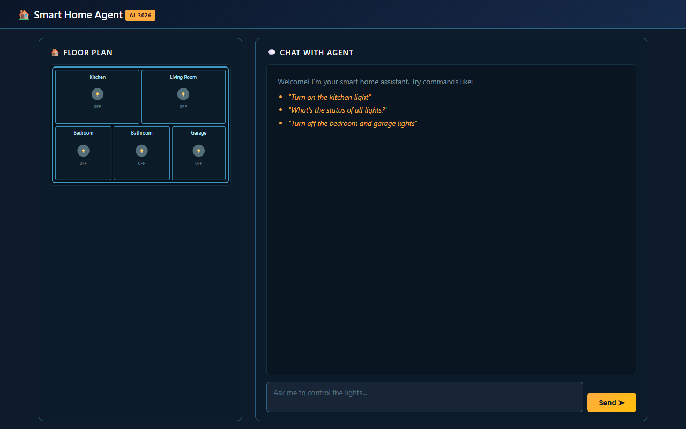
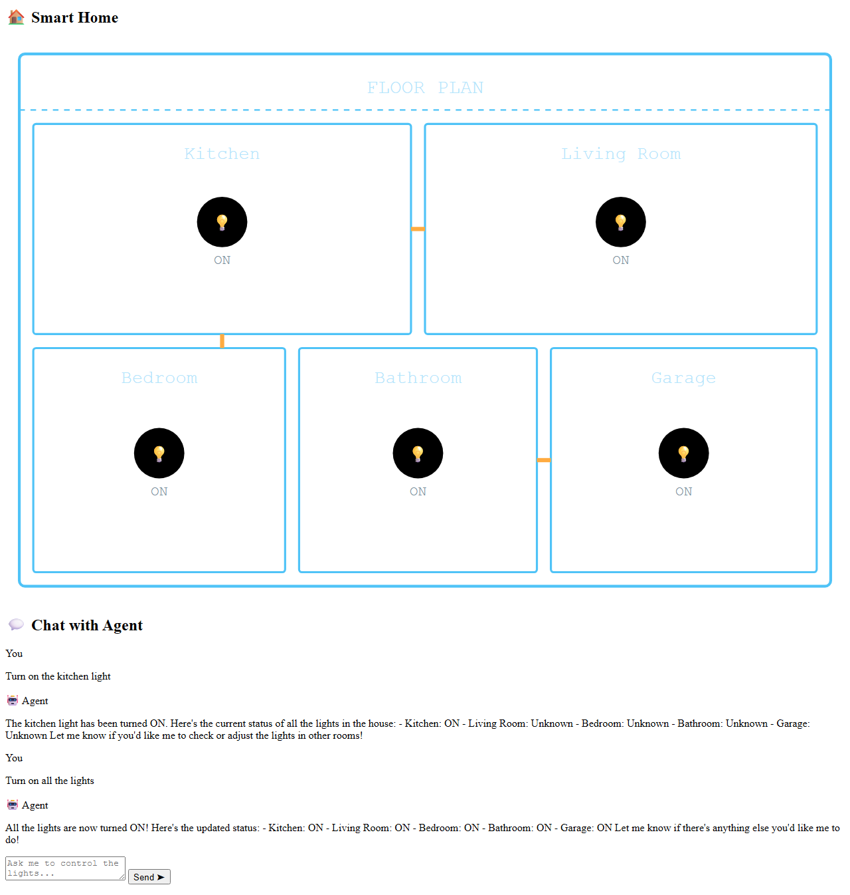
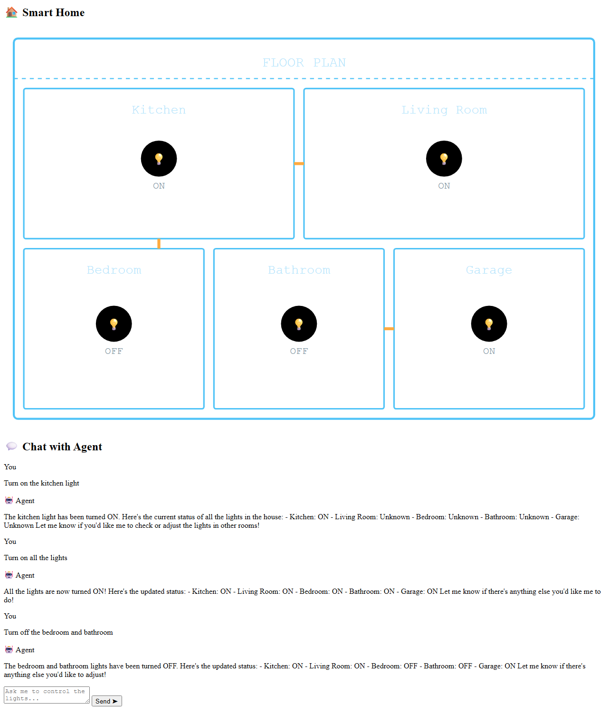

# Demo Guide — AI-3026 Smart Home Agent

> A step-by-step presenter guide for demonstrating natural language smart home
> control using Azure AI Foundry Agents with the Responses API and tool calling.

## Table of Contents

- [Overview](#overview)
- [Target Audience](#target-audience)
- [Prerequisites](#prerequisites)
- [Pre-Demo Checklist](#pre-demo-checklist)
- [Demo Flow](#demo-flow)
  - [Step 1: Open the Web App](#step-1-open-the-web-app)
  - [Step 2: Show the House Blueprint](#step-2-show-the-house-blueprint)
  - [Step 3: Turn On a Single Light](#step-3-turn-on-a-single-light)
  - [Step 4: Ask for Status](#step-4-ask-for-status)
  - [Step 5: Turn On All Lights](#step-5-turn-on-all-lights)
  - [Step 6: Selective Control](#step-6-selective-control)
  - [Step 7: Session Isolation](#step-7-session-isolation)
- [Behind the Scenes](#behind-the-scenes)
- [Azure Portal Walkthrough](#azure-portal-walkthrough)
- [Key Talking Points](#key-talking-points)
- [Contingency Playbook](#contingency-playbook)
- [Teardown Instructions](#teardown-instructions)

---

## Overview

This demo showcases how Azure AI Foundry's **Agents API** (using the **Responses API**
pattern) can use **tool calling** to control a virtual smart home through natural
language. Users type commands like "Turn on the kitchen light" and a gpt-4o
agent interprets the intent, invokes local tool functions, and updates an
interactive SVG floor plan in real time.

**What the audience will see:**

- A browser-based smart home with 5 rooms rendered as an SVG blueprint
- Natural language commands that control room lights
- Real-time visual feedback (rooms turn yellow when on, gray when off)
- AI-powered status reporting across all rooms
- Session isolation between browser windows

**Estimated demo time:** 8-12 minutes

---

## Target Audience

| Audience                 | Focus                                                  |
| ------------------------ | ------------------------------------------------------ |
| AI-3026 course attendees | How Foundry Agents tool calling works in practice      |
| Developers               | .NET integration with Azure OpenAI, session management |
| Architects               | Managed Identity auth, RBAC, serverless AI patterns    |
| Decision makers          | Natural language UX for IoT/home automation scenarios  |

---

## Prerequisites

| Requirement              | Details                                    |
| ------------------------ | ------------------------------------------ |
| Deployed app             | Web app running at the URL below           |
| Browser                  | Any modern browser (Edge, Chrome, Firefox) |
| Azure Portal access      | To show deployed resources (optional)      |
| Second browser/incognito | For session isolation demo (Step 7)        |

**Deployed Resources:**

| Resource       | Value                                                          |
| -------------- | -------------------------------------------------------------- |
| Web App URL    | https://app-ai3026smarthome-ai3026smarthome.azurewebsites.net/ |
| Resource Group | `rg-ai3026smarthome-ai3026smarthome`                           |
| Region         | Sweden Central                                                 |
| Subscription   | ME-MngEnvMCAP464590-robfoulkrod-1                              |

---

## Pre-Demo Checklist

- [ ] Verify the web app is accessible — open the URL and confirm the house blueprint loads
- [ ] Close any previous sessions (clear cookies or use incognito)
- [ ] Prepare a second browser window (or incognito) for Step 7
- [ ] Optionally, open the Azure Portal to the resource group in a separate tab
- [ ] Ensure screen sharing is active if presenting remotely
- [ ] Test a simple command ("Turn on the kitchen light") to warm up the model

---

## Demo Flow

### Step 1: Open the Web App

Open the deployed application in your browser:

```
https://app-ai3026smarthome-ai3026smarthome.azurewebsites.net/
```

You should see a dark-themed page with a smart home SVG blueprint on the left
and a chat interface on the right.



**Talking point:** "This is a .NET 10 Razor Pages app running on Azure App
Service. The floor plan is a pure SVG rendered server-side — no JavaScript
framework required."

---

### Step 2: Show the House Blueprint

Point out the 5 rooms visible in the floor plan:

| Room        | Position      | Initial State |
| ----------- | ------------- | ------------- |
| Kitchen     | Top-left      | OFF (gray)    |
| Living Room | Top-right     | OFF (gray)    |
| Bedroom     | Bottom-left   | OFF (gray)    |
| Bathroom    | Bottom-center | OFF (gray)    |
| Garage      | Bottom-right  | OFF (gray)    |

**Talking point:** "Each room has a light bulb indicator. Gray means off,
yellow means on. All lights start off for each new session."

---

### Step 3: Turn On a Single Light

Type the following command in the chat input:

```
Turn on the kitchen light
```

Press Enter or click the send button. Wait a few seconds for the AI to respond.


**Expected result:**

- The Kitchen room's light bulb turns **yellow**
- The label changes from "OFF" to "ON"
- The AI responds with a confirmation message

**Talking point:** "The user typed a natural language command. Under the hood,
gpt-4o received this message, decided to call the `turn_light_on` tool with
parameter `Kitchen`, and the server executed that function locally — no
external API call needed for the tool itself."

---

### Step 4: Ask for Status

Type:

```
What's the status of all lights?
```

**Expected result:**

- The AI calls `get_all_light_status` and returns a summary
- Something like: "Kitchen: ON, Living Room: OFF, Bedroom: OFF, Bathroom: OFF, Garage: OFF"

**Talking point:** "Notice the agent chose to call `get_all_light_status` —
a read-only tool. The Foundry Agent decides which tool to invoke based on
the user's intent. It can also combine multiple tool calls in a single turn."

---

### Step 5: Turn On All Lights

Type:

```
Turn on all the lights
```



**Expected result:**

- All 5 rooms light up **yellow**
- The AI confirms each room was turned on

**Talking point:** "The agent made 4 separate `turn_light_on` tool calls
(Kitchen was already on). The Foundry Agents API supports parallel tool calling —
the model can request multiple tool invocations in a single response."

---

### Step 6: Selective Control

Type:

```
Turn off the bedroom and bathroom
```



**Expected result:**

- Bedroom and Bathroom return to **gray** (OFF)
- Kitchen, Living Room, and Garage remain **yellow** (ON)

**Talking point:** "The agent understood a multi-room command and made
exactly 2 tool calls. This demonstrates the model's ability to parse
compound instructions and map them to discrete tool invocations."

---

### Step 7: Session Isolation

1. Open a **second browser window** or an **incognito/private window**
2. Navigate to the same URL
3. Notice that all lights are **OFF** in the new window

**Talking point:** "Each browser session gets its own conversation thread
and house state. This is managed via ASP.NET Core in-memory sessions —
each user has an isolated `HouseState` object and a separate response chain
(via `previousResponseId`). No database needed for this demo."

---

## Behind the Scenes

### Request Flow

```
┌──────────────┐    ┌────────────────────┐    ┌──────────────────────┐
│   Browser    │───▶│  ASP.NET Core App   │───▶│  Azure OpenAI        │
│              │    │  (App Service)       │    │  Foundry Agents      │
│  User types  │    │                      │    │  (gpt-4o)            │
│  "Turn on    │    │  1. Load session     │    │                      │
│   kitchen"   │    │     (HouseState +    │    │  2. Model decides    │
│              │    │      ResponseId)     │    │     to call          │
│              │◀───│                      │◀───│     turn_light_on    │
│  SVG updates │    │  3. Execute tool     │    │     ("Kitchen")      │
│  Kitchen=ON  │    │     locally          │    │                      │
│              │    │  4. Return result    │───▶│  4. Model generates  │
│              │◀───│  5. Update SVG       │◀───│     final response   │
└──────────────┘    └────────────────────┘    └──────────────────────┘
```

### Tool Calling Loop

1. User message is sent via `CreateResponseAsync` with `previousResponseId` for context
2. The Foundry Agent (gpt-4o) processes the message and returns a response
3. If the response contains `FunctionCallResponseItem` outputs, tools are needed
4. The app executes each tool locally against the in-memory `HouseState`
5. Tool outputs are sent as `FunctionCallOutputItem` in a follow-up request
6. Steps 3-5 repeat if the model needs more tool calls
7. The final response contains the text message
8. The page re-renders with the updated SVG

### Tool Definitions

| Tool                    | Purpose                            | Parameters  |
| ----------------------- | ---------------------------------- | ----------- |
| `get_all_light_status`  | Returns ON/OFF for all 5 rooms     | None        |
| `get_room_light_status` | Returns ON/OFF for a specific room | `room_name` |
| `turn_light_on`         | Turns on a room's light            | `room_name` |
| `turn_light_off`        | Turns off a room's light           | `room_name` |

### Authentication

The web app authenticates to Azure OpenAI using **Managed Identity** — no API
keys or connection strings. The App Service has a system-assigned managed
identity with these RBAC roles:

| Role               | Scope               | Purpose                               |
| ------------------ | ------------------- | ------------------------------------- |
| Azure AI User      | AI Services account | Access Foundry project and agent APIs |
| Azure AI Developer | AI Services account | Create/manage agents and model access |

---

## Azure Portal Walkthrough

Open the Azure Portal and navigate to the resource group:

```
Portal → Resource Groups → rg-ai3026smarthome-ai3026smarthome
```

Or use this direct link:
https://portal.azure.com/#@/resource/subscriptions/96d0d57a-566f-4b73-bc46-345620f9a3e7/resourceGroups/rg-ai3026smarthome-ai3026smarthome/overview

### Resources to Highlight

| Resource                | Type             | Key Points                                 |
| ----------------------- | ---------------- | ------------------------------------------ |
| `ai-ai3026smarthome-*`  | AI Services      | S0 tier, hosts the gpt-4o model deployment |
| `asp-ai3026smarthome-*` | App Service Plan | P1v3 Linux, supports zone redundancy       |
| `app-ai3026smarthome-*` | App Service      | .NET 10, system-assigned managed identity  |
| `log-ai3026smarthome-*` | Log Analytics    | PerGB2018, collects diagnostics            |

### What to Show

1. **App Service → Identity blade:** Point out the system-assigned managed identity is ON
2. **App Service → Configuration:** Show `AI_SERVICES_ENDPOINT` — no API keys stored
3. **AI Services → Model deployments:** Show the gpt-4o deployment
4. **Resource Group → Access control (IAM):** Show the RBAC role assignments
5. **Log Analytics → Logs:** Optionally run a KQL query to show recent requests

---

## Key Talking Points

| Topic                   | Talking Point                                                                                                                                             |
| ----------------------- | --------------------------------------------------------------------------------------------------------------------------------------------------------- |
| **Tool Calling**        | "The Foundry Agents API doesn't just generate text — it can decide to call functions you define, execute them, and use the results to form its response." |
| **No API Keys**         | "This app has zero secrets. Managed Identity + RBAC means the app authenticates to Azure OpenAI without any keys or connection strings."                  |
| **Session State**       | "Each user gets their own response chain and house state. The server manages this through ASP.NET sessions — no database required."                       |
| **Composable Tools**    | "The 4 simple tools compose naturally. The model can turn on one light, all lights, or check status — all from the same tool set."                        |
| **Real-World Pattern**  | "This same pattern applies to any scenario: booking systems, device control, data queries. Define your tools, let the AI decide when to call them."       |
| **Parallel Tool Calls** | "When you say 'turn on all lights', the model can request multiple tool calls in a single step — it doesn't need to go one by one."                       |

---

## Contingency Playbook

| Issue                       | Symptom                        | Resolution                                                                                                 |
| --------------------------- | ------------------------------ | ---------------------------------------------------------------------------------------------------------- |
| App not loading             | Browser shows 5xx or timeout   | Check App Service is running: Portal → App Service → Overview → Status. Restart if needed.                 |
| Slow AI response            | Chat takes >15 seconds         | gpt-4o cold start or rate limiting. Wait and retry. Mention this is expected for first request after idle. |
| Light not updating visually | AI responds but SVG unchanged  | Hard refresh the page (Ctrl+Shift+R). Check browser console for errors.                                    |
| "Rate limit exceeded" error | 429 response from Azure OpenAI | Wait 30 seconds and retry. The demo uses Standard tier (30K TPM).                                          |
| Session lost                | Lights reset unexpectedly      | App Service may have restarted. Sessions are in-memory and ephemeral — start the demo flow again.          |

---

## Teardown Instructions

When the demo is complete, clean up all Azure resources:

```powershell
# Navigate to the project directory
cd scenario/ai-3026-smart-home

# Tear down all resources (no confirmation prompts)
azd down --purge --force
```

The `--purge` flag ensures soft-deleted resources (like AI Services) are permanently
removed. The `--force` flag skips confirmation prompts.

**Estimated teardown time:** 2-5 minutes.

> **Warning:** This permanently deletes all resources in the resource group.
> Ensure you have captured any screenshots or logs you need before running teardown.
